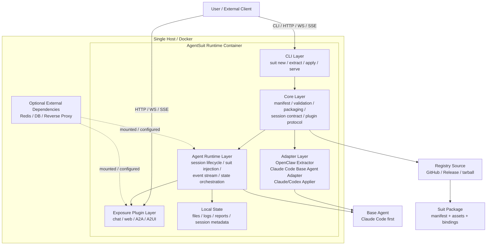

# Agent Suit 详细设计

## 1. 文档信息

- 项目名称：Agent Suit
- 文档类型：详细设计（Detailed Design）
- 当前版本：v0.1 草案
- 目标读者：项目发起人、核心开发者、潜在贡献者
- 设计目标：定义一套可实现、可分享、可扩展的 Suit 提取与分发机制，并补充一个面向单机 Docker 的 Agent Service Runtime，使用户不仅可以在不同 Runtime 间提取与应用 Suit，还可以基于 Base Agent 一键部署一个可通过端口交互的通用 Agent 服务。

---

## 2. 背景与目标

### 2.1 背景

当前不同 Agent Runtime（如 OpenClaw、Claude Code、Codex）已经具备各自的扩展机制，例如：

- 增量 system prompt / instruction overlay
- tools / MCP server 绑定
- skills / workflows
- memory / context source
- multi-agent / coworker / subagent
- approval / safety policy

这些能力在不同平台中存在，但缺乏统一的、可移植的、可分享的抽象层。用户在一个运行时里配置好的 Agent，通常无法方便地导出为可复用能力包，也难以迁移到其他运行时。

同时，现有 Agent 生态仍然偏“本地开发工具”或“平台内运行时”，缺少一种足够落地的交付方式，使用户可以把某个 Base Agent 与 Suit 组合后，直接作为服务部署到 Docker 容器中，并通过 `chat`、`web`、`A2A`、`A2UI` 等入口与之交互。

### 2.2 目标

本项目提出并实现 **Agent Suit** 概念：

> Suit 是附着在 Base Agent 之上的可移植增强层，封装特定场景所需的 prompt、tools、skills、memory、coworkers 和 policy，使其可以被提取、分享、安装、应用。

并在此基础上补充 **Agent Service Runtime** 概念：

> Agent Service Runtime 是一个将 Base Agent 与 Suit 组装为可部署服务的运行时壳层，负责 session 生命周期、事件流、插件暴露、状态存储与 Docker 化交付。

### 2.3 项目目标

v0.1 的具体目标如下：

1. 定义统一的 Suit Manifest 规范。
2. 实现 CLI，用于创建、校验、提取、打包、发布、安装、应用 Suit。
3. 支持从 OpenClaw 抽取 Suit。
4. 支持将 Suit 应用到 OpenClaw / Claude Code / Codex。
5. 提供一个单机 Docker 优先的 Agent Service Runtime，使 Base Agent + Suit 可以通过 `docker run` 启动为服务。
6. 定义统一的 session / event / stream 抽象，使 `chat`、`web`、`A2A`、`A2UI` 等交互入口能够以插件方式接入。
7. 提供分享机制，使用户可以把 Suit 发布给别人使用。
8. 提供脱敏与安全校验，避免泄漏 secrets、token、路径等本地信息。

### 2.4 非目标

v0.1 不包含以下内容：

- 完整迁移会话历史
- 完整跨平台行为一致性保证
- 托管型云端 registry 服务
- 图形化管理界面
- 复杂实时多 Agent 调度引擎
- 私有 memory 数据本体同步
- Kubernetes-first 编排与多租户控制面
- 单容器内动态拉起多个子容器 Agent 的宿主管理器

---

## 3. 术语定义

### 3.1 Base Agent

基础智能体，提供底层模型推理、基础执行能力和宿主运行时。第一阶段优先支持 Claude Code 作为 Base Agent。

### 3.2 Suit

可移植的增强包，用于对 Base Agent 进行场景化增量增强。

### 3.3 Runtime

Agent 实际运行的平台或宿主，例如：

- OpenClaw
- Claude Code
- Codex

### 3.4 Extract

从某一 Runtime 中读取现有 Agent 配置，经过归一化和脱敏后，生成 Suit 的过程。

### 3.5 Apply

将 Suit 映射并应用到目标 Runtime 的过程。

### 3.6 Binding

Suit 中与具体 Runtime 相关的适配信息。

### 3.7 Share Mode

Suit 中资源的分享模式：

- `embed`：内容直接打包到 Suit
- `reference`：仅记录引用路径或标识
- `external`：目标环境需自行绑定

### 3.8 Agent Service Runtime

用于托管 `Base Agent + Suit` 的服务运行时，负责统一 session 生命周期、状态存储、端口暴露和插件接入。

### 3.9 Exposure Plugin

将内部统一的 Agent session API 映射到外部交互入口的插件，例如 `chat`、`web`、`A2A`、`A2UI`。

### 3.10 Session API

运行时内部统一会话抽象，至少包括 `startSession`、`sendInput`、`streamEvents`、`interrupt`、`closeSession`、`healthCheck` 等能力。

---

## 4. 总体设计

## 4.1 设计原则

### 4.1.1 可移植优先

Suit 是平台无关的逻辑能力包，而不是某个平台配置文件的镜像。

### 4.1.2 增量增强优先

Suit 不替代 Base Agent，只描述附加能力。

### 4.1.3 可分享优先

导出的 Suit 必须支持打包、分发和被其他用户安装。

### 4.1.4 安全优先

任何导出过程都必须默认进行脱敏，避免泄漏用户本地机密信息。

### 4.1.5 最小实现优先

v0.1 只实现最关键闭环：

- extract
- validate
- pack
- publish
- pull
- apply
- serve

### 4.1.6 单机 Docker 优先

第一阶段优先保证 `docker run` 可启动的单机部署体验，而不是依赖 Docker Compose 或 Kubernetes。

### 4.1.7 插件暴露优先

外部交互方式不是 Runtime 核心的一部分，而是通过插件暴露。核心只维护统一的 session / event / stream 抽象。

---

## 4.2 系统架构

整体架构分为 6 层：



```text
+---------------------------------------------------------------+
|                 Single Host / Docker Runtime                  |
|                                                               |
|  +---------------------------------------------------------+  |
|  |              AgentSuit Runtime Container                |  |
|  |                                                         |  |
|  |  +-----------+   +-------------+   +-----------------+  |  |
|  |  | CLI Layer |-->| Core Layer  |-->| Adapter Layer   |--+---> Base Agent
|  |  | new/apply |   | manifest    |   | Claude Code     |  |  |    (Claude Code first)
|  |  | serve     |   | validate    |   | OpenClaw/Codex  |  |  |
|  |  +-----------+   | package     |   +-----------------+  |  |
|  |                  | plugin API  |                        |  |
|  |                  +------+------+                        |  |
|  |                         |                               |  |
|  |                         v                               |  |
|  |                +-------------------+                    |  |
|  |                | Agent Runtime     |<-------------------+  |
|  |                | suit injection    |                       |
|  |                | session lifecycle |----+                  |
|  |                | event stream      |    |                  |
|  |                +---------+---------+    |                  |
|  |                          |              |                  |
|  |                          v              v                  |
|  |                +----------------+  +-------------------+   |
|  |                | Local State    |  | Exposure Plugins  |---+---> chat / web / A2A / A2UI
|  |                | files / logs   |  | HTTP / WS / SSE   |   |
|  |                | reports        |  +-------------------+   |
|  |                +----------------+                          |
|  +---------------------------------------------------------+  |
|                 ^                            ^                |
|                 |                            |                |
|      optional mount/config         optional mount/config      |
|                 |                            |                |
|         +---------------+          +----------------------+   |
|         | Redis / DB    |          | Reverse Proxy / LB   |   |
|         +---------------+          +----------------------+   |
+---------------------------------------------------------------+

User / Client
  |- CLI -> suit new / extract / apply / serve
  |- HTTP / WS / SSE -> plugin endpoints
  `- Registry pull/publish -> GitHub / Release / tarball
```

### 4.2.1 CLI Layer

负责命令解析、用户交互、日志输出、调用核心服务。既包含 Suit 生命周期命令，也包含服务运行命令。

### 4.2.2 Core Layer

负责：

- Manifest 解析
- Schema 校验
- 资源解析
- 脱敏
- 打包与解包
- 依赖检查
- Diff / Inspect
- Session 规范
- 插件协议定义

### 4.2.3 Adapter Layer

负责不同 Runtime 的提取、应用与会话适配：

- OpenClaw Extractor / Applier
- Claude Code Applier
- Codex Applier

并补充：

- Claude Code Base Agent Adapter

### 4.2.4 Agent Runtime Layer

负责运行中的 `Base Agent + Suit` 组装与会话编排：

- 加载 Base Agent Adapter
- 加载 Suit
- 注入 prompt / tools / skills / policy / memory
- 管理 session 生命周期
- 统一事件流

### 4.2.5 Exposure Plugin Layer

负责将内部 session API 暴露为不同交互协议：

- chat plugin
- web plugin
- A2A plugin
- A2UI plugin

### 4.2.6 Registry Layer

负责本地包管理、远端发布和拉取。

第一阶段可以先支持 GitHub 仓库 / Release / tarball URL 的分发方式。

---

## 4.3 模块划分

建议 monorepo 结构：

```text
agent-suit/
  packages/
    cli/
    core/
    schema/
    adapter-openclaw/
    adapter-claude-code/
    adapter-codex/
    runtime/
    plugin-chat/
    plugin-web/
    plugin-a2a/
    plugin-a2ui/
    registry/
  examples/
    suits/
      golang-backend/
      bugfix-warroom/
  docs/
    spec.md
    cli.md
    runtime-mapping.md
```

---

## 5. Suit 数据模型设计

## 5.1 三层模型

Suit 由三部分组成：

### 5.1.1 Manifest

描述 Suit 的逻辑结构与元数据。

### 5.1.2 Assets

描述与 Suit 绑定的资源文件：

- prompt 文件
- skill 文档
- hook 脚本
- template 文件
- schema 文件

### 5.1.3 Bindings

描述与具体 Runtime 的映射与来源信息。

即：

> Suit = Manifest + Assets + Bindings

---

## 5.2 目录结构

标准 Suit 目录如下：

```text
my-suit/
  suit.yaml
  README.md
  assets/
    prompts/
      system.md
      review.md
    skills/
      analyze-requirements.md
      write-go-handler.md
      prepare-pr.md
    hooks/
      pre-apply.sh
      post-apply.sh
    templates/
      pr.md
  bindings/
    openclaw/
      extracted.json
    claude-code/
      apply.json
    codex/
      apply.json
  schemas/
    output.schema.json
```

---

## 5.3 Manifest 结构

建议定义如下：

```yaml
apiVersion: suit.agent/v1
kind: Suit

metadata:
  name: golang-backend
  version: 0.1.0
  title: Go Backend Suit
  description: Portable augmentation pack for Go backend delivery
  author: overlink
  license: MIT
  homepage: https://github.com/example/agent-suit
  tags: [golang, backend, coding]

base:
  compatibility:
    runtimes:
      - openclaw
      - claude-code
      - codex
  target:
    domain: software-engineering
    mode: coding-agent

service:
  mode: agent-service
  baseAgent: claude-code
  session:
    eventStream: sse
    persistence: local-file
  exposures:
    - name: web
      plugin: "@agentsuit/plugin-web"
      port: 8080
      path: /
    - name: chat
      plugin: "@agentsuit/plugin-chat"
      port: 8090
      path: /chat
  optionalDependencies:
    - redis

identity:
  role: Senior Go backend engineer
  goals:
    - deliver safe production changes
    - prefer simple and testable implementations
  constraints:
    - follow repository conventions
    - avoid speculative abstraction

prompt:
  overlays:
    - file: assets/prompts/system.md
  vars:
    language: go

tools:
  declarations:
    - name: github
      kind: mcp
      required: true
      shareMode: external
    - name: postgres
      kind: mcp
      required: false
      shareMode: external
    - name: ripgrep
      kind: local
      required: true
      shareMode: reference
  aliases:
    code_search: ripgrep

skills:
  entries:
    - name: analyze-requirements
      file: assets/skills/analyze-requirements.md
      shareMode: embed
    - name: write-go-handler
      file: assets/skills/write-go-handler.md
      shareMode: embed

memory:
  sources:
    - name: repo-conventions
      kind: file
      uri: ./AGENTS.md
      shareMode: reference
    - name: architecture
      kind: file
      uri: ./docs/architecture.md
      shareMode: reference

coworkers:
  agents:
    - name: reviewer
      role: code-reviewer
      handoff: summarize-only
    - name: tester
      role: test-runner
      handoff: findings-only

policy:
  approvals:
    mode: on-request
  safety:
    allowShell: true
    destructiveOps: deny-by-default

outputs:
  contracts:
    - name: pr-summary
      template: assets/templates/pr.md

provenance:
  extractedFrom:
    runtime: openclaw
    version: x.y.z
    timestamp: 2026-03-20T10:00:00Z
  redactions:
    - auth sessions removed
    - local absolute paths normalized

dependencies:
  runtimes:
    claude-code: '>=1.0.0'
    codex: '>=0.1.0'
```

---

## 5.4 字段说明

### metadata

用于描述 Suit 的基础元数据。

### base

用于描述 Suit 适配的目标 Runtime 与目标场景。

### identity

用于描述角色、目标与约束，是对 Base Agent 的身份增强层。

### service

用于描述 Suit 以服务方式运行时的默认行为，包括目标 Base Agent、会话事件流、暴露插件和端口建议。

### prompt

用于定义增量 prompt overlay 及模板变量。

### tools

用于定义所需工具与别名，不直接保存 secrets。

### skills

用于定义可复用技能条目。

### memory

用于定义 memory 源，仅存引用或声明，不默认打包底层数据。

### coworkers

用于定义协作 Agent 的角色与交接方式。

### policy

用于定义审批策略与安全策略。

### outputs

用于定义输出模板或契约。

### provenance

用于记录提取来源和脱敏行为，便于审计与回溯。

### dependencies

用于声明运行时或工具依赖。

---

## 6. Runtime 抽象与映射设计

## 6.1 统一抽象模型

CLI 内部不直接操作平台私有格式，而是操作统一中间模型：

```text
NormalizedSuitModel
  metadata
  identity
  prompt overlays
  tools
  skills
  memory sources
  coworkers
  policy
  outputs
  provenance
```

所有 Extractor 都必须先输出 `NormalizedSuitModel`，再由 Serializer 生成标准 Suit 文件。

所有 Applier 都必须从 `NormalizedSuitModel` 读取，再映射到目标 Runtime。

---

## 6.2 OpenClaw 提取映射

### 来源候选

- agent scope 配置
- persona / rules 文件
- tool binding 定义
- workspace 指令
- multi-agent routing / coworker 信息
- local notes / memory bindings

### 映射规则

- persona / role → `identity`
- workspace rules → `prompt.overlays`
- tools / MCP bindings → `tools.declarations`
- reusable notes / workflows → `skills.entries`
- memory refs → `memory.sources`
- other agents / handoff → `coworkers.agents`
- permissions / approvals → `policy`

### 不导出内容

- auth profile
- secrets
- session 历史
- token
- 绝对路径
- 本机临时状态

---

## 6.3 Claude Code 应用映射

目标映射方向：

- prompt overlays → 项目 instructions / CLAUDE.md 增量片段
- skills → Claude Code skills
- coworkers → subagents
- tools → MCP / plugins / local tools
- policy → approval mode / hooks 约束

apply 阶段不要求 100% 保真，而要求最大化映射与可解释降级。

例如：

- 如果 Suit 中声明了某 coworker，但 Claude Code 当前不支持该 handoff 策略，则转换为普通 subagent 定义，并记录 warning。

---

## 6.4 Codex 应用映射

目标映射方向：

- prompt overlays → runtime/project-level instructions
- tools → MCP / local executable tool
- skills → reusable workflow docs / command recipes
- coworkers → subagents
- policy → approval mode / execution safety policy

同样允许降级应用。

---

## 6.5 Agent Service Runtime 抽象

在 `apply` 之外，系统还需要支持将 `Base Agent + Suit` 装配为一个可运行的服务实例。第一阶段采用以下约束：

- 单机 Docker 优先
- 默认单容器即可运行
- 默认单实例 agent service
- 未来预留多 agent，但 v0.1 不实现容器内多 agent 编排
- 可选接入外部 Redis / DB / Reverse Proxy

运行时的内部目标不是重新实现一个模型推理引擎，而是统一以下职责：

- Base Agent 进程或会话适配
- Suit 注入
- session 生命周期管理
- event / stream 统一抽象
- exposure 插件注册与端口绑定
- 状态落盘与审计报告

### 6.5.1 服务实例模型

建议内部抽象如下：

```text
AgentServiceInstance
  instanceId
  baseAgent
  loadedSuit
  sessionManager
  pluginHost
  stateStore
  healthState
```

### 6.5.2 首阶段实例边界

v0.1 的推荐边界：

- 一个容器对应一个 `AgentServiceInstance`
- 一个实例对应一个 Base Agent
- 一个实例可以挂多个 exposure plugins
- 一个实例可以同时服务多个 session
- session 之间共享同一个 Suit，但拥有独立上下文与事件流

### 6.5.3 Base Agent 适配边界

以 Claude Code 为例，运行时层不直接依赖其内部文件结构，而是通过 Base Agent Adapter 提供统一能力：

- 初始化运行环境
- 启动会话
- 发送用户输入
- 接收增量事件
- 中断与终止
- 健康检查
- 版本探测

这样后续接入 OpenClaw、Codex 或其他 Base Agent 时，不会污染核心运行时逻辑。

---

## 6.6 Session API 与事件流

Exposure 插件与 Base Agent 之间不直接耦合，而是统一经过 Session API。

### 6.6.1 最小 Session API

建议定义：

```ts
export interface SessionApi {
  startSession(input?: StartSessionInput): Promise<SessionHandle>;
  sendInput(sessionId: string, input: UserInput): Promise<void>;
  streamEvents(sessionId: string): AsyncIterable<AgentEvent>;
  interrupt(sessionId: string): Promise<void>;
  closeSession(sessionId: string): Promise<void>;
  healthCheck(): Promise<HealthStatus>;
}
```

### 6.6.2 事件模型

建议统一事件类型：

- `session.started`
- `input.accepted`
- `agent.thinking`
- `agent.message.delta`
- `agent.message.completed`
- `tool.call.started`
- `tool.call.completed`
- `tool.call.failed`
- `session.interrupted`
- `session.completed`
- `session.failed`

### 6.6.3 流式输出协议

v0.1 推荐优先支持：

- HTTP SSE
- WebSocket

原因：

- SSE 适合 `web` 与简单 `chat` 前端
- WebSocket 适合双向实时交互与未来 A2UI 扩展
- 二者都容易通过单机 Docker 暴露端口

---

## 6.7 Exposure Plugin 抽象

插件负责把统一 Session API 暴露为不同协议，而不是直接操纵 Suit 或 Base Agent。

### 6.7.1 插件职责

- 声明启动参数
- 声明端口占用
- 注册 HTTP / WS / SSE 路由
- 将外部请求转换为 Session API 调用
- 将 Agent 事件流转换为插件协议输出
- 输出插件侧审计日志

### 6.7.2 插件接口建议

```ts
export interface ExposurePlugin {
  name: string;
  kind: "chat" | "web" | "a2a" | "a2ui" | string;
  defaultPort?: number;
  setup(context: PluginContext): Promise<void>;
  start(): Promise<void>;
  stop(): Promise<void>;
}
```

### 6.7.3 首批插件建议

- `plugin-web`
  - 提供浏览器访问入口
  - 支持创建 session、发送消息、订阅事件流
- `plugin-chat`
  - 可基于现成 npm chat 包进行封装
  - 负责聊天室会话管理与消息路由
- `plugin-a2a`
  - 作为 agent-to-agent 协议适配器
- `plugin-a2ui`
  - 作为 UI 协议或组件交互层适配器

### 6.7.4 插件与端口策略

建议：

- 每个插件默认独占一个监听端口
- 如用户指定统一反向代理，可通过 path 路由聚合到同一入口
- 插件必须声明其监听协议、端口、健康检查路径与鉴权方式

---

## 6.8 端口与网络暴露模型

单机 Docker 场景下，推荐以下默认端口约定：

- `8080`：web plugin
- `8090`：chat plugin
- `8091`：A2A plugin
- `8092`：A2UI plugin
- `9000`：runtime admin / health / metrics

### 6.8.1 基本原则

- 外部只暴露插件端口和管理端口
- Base Agent 自身进程不直接对外暴露私有端口
- 插件必须经过运行时鉴权和 session 路由层
- 支持通过 `-p` 精确映射容器端口到宿主机端口

### 6.8.2 健康检查

容器建议至少暴露：

- `/healthz`：存活检查
- `/readyz`：就绪检查
- `/metrics`：可选运行时指标

---

## 7. CLI 设计

## 7.1 命令列表

### 初始化与创建

```bash
suit init
suit new <name>
```

### 提取

```bash
suit extract openclaw --agent <agent-name> --out ./my-suit
suit extract claude-code --project . --out ./my-suit
suit extract codex --project . --out ./my-suit
```

### 校验与检查

```bash
suit validate ./my-suit
suit inspect ./my-suit
suit diff ./suit-a ./suit-b
```

### 安全与打包

```bash
suit redact ./my-suit
suit pack ./my-suit
suit unpack ./my-suit-0.1.0.suit.tgz
```

### 发布与拉取

```bash
suit publish ./my-suit
suit pull owner/golang-backend
suit add owner/golang-backend
```

### 应用

```bash
suit apply ./my-suit --runtime openclaw
suit apply ./my-suit --runtime claude-code
suit apply ./my-suit --runtime codex
```

### 服务运行

```bash
suit serve ./my-suit --base-agent claude-code --expose web --port 8080
suit serve ./my-suit --base-agent claude-code --expose chat --port 8090
suit serve ./my-suit --base-agent claude-code --expose web --expose chat
```

---

## 7.2 命令行为定义

## 7.2.1 suit init

作用：

- 在当前目录初始化 `agent-suit` 工作空间
- 生成全局配置目录
- 检测 Node.js 版本与环境依赖

输出：

- `.agent-suit/config.yaml`

---

## 7.2.2 suit new

作用：

- 创建标准 Suit 目录骨架

输入：

- Suit 名称

输出：

- suit.yaml
- README.md
- assets 目录结构

---

## 7.2.3 suit extract

作用：

- 从目标 Runtime 提取 Agent 配置
- 执行归一化和脱敏
- 输出标准 Suit

处理流程：

1. 读取来源 Runtime 配置
2. 转换为中间模型
3. 自动检测敏感项
4. 执行 redaction
5. 生成目录结构与 manifest
6. 输出报告

输出：

- 标准 Suit 目录
- `bindings/<runtime>/extracted.json`
- `extract-report.json`

---

## 7.2.4 suit validate

作用：

- 校验 schema
- 校验资源完整性
- 校验依赖合法性
- 检测潜在 secrets

错误类型：

- SCHEMA_ERROR
- FILE_MISSING
- INVALID_SHARE_MODE
- SECRET_DETECTED
- UNSUPPORTED_RUNTIME

---

## 7.2.5 suit inspect

作用：

- 以友好形式展示 Suit 内容摘要

展示内容：

- metadata
- runtime compatibility
- tools
- skills
- coworkers
- memory refs
- policy
- warnings

---

## 7.2.6 suit redact

作用：

- 对现有 Suit 再执行脱敏检查与处理

场景：

- 手动修改后重新校验
- 发布前最后审查

---

## 7.2.7 suit pack

作用：

- 将 Suit 打包为可分享压缩包

输出格式：

- `<name>-<version>.suit.tgz`

包含内容：

- suit.yaml
- README.md
- assets/
- bindings/
- schemas/
- checksum

---

## 7.2.8 suit publish

作用：

- 将 Suit 发布到指定 registry 源

v0.1 支持：

- GitHub 仓库
- GitHub Release 资产
- HTTP tarball URL

---

## 7.2.9 suit pull / suit add

作用：

- 从远端下载 Suit
- 解包到本地缓存或当前工作目录

---

## 7.2.10 suit apply

作用：

- 将 Suit 应用到目标 Runtime

处理流程：

1. 读取 Suit
2. 校验目标 Runtime 兼容性
3. 检查依赖工具
4. 映射至目标配置
5. 生成或修改目标 Runtime 所需文件
6. 输出 apply 报告

输出：

- `apply-report.json`
- 目标 Runtime 下对应配置变更

---

## 7.2.11 suit serve

作用：

- 加载 Suit
- 初始化 Base Agent Runtime
- 启动 Agent Service Runtime
- 注册 exposure plugins
- 对外暴露服务端口

处理流程：

1. 读取 Suit
2. 校验 Base Agent 与服务配置
3. 加载 Base Agent Adapter
4. 构建 Session API
5. 启动插件宿主
6. 绑定端口
7. 输出服务运行信息与运行报告

输入参数建议：

- `--base-agent <name>`
- `--expose <plugin>`
- `--plugin <package-or-path>`
- `--port <port>`
- `--host <host>`
- `--state-dir <path>`
- `--report-dir <path>`
- `--config <path>`
- `--detach`

输出：

- 控制台服务摘要
- `serve-report.json`
- 监听端口信息
- 健康检查地址

### 7.2.11.1 行为约束

- 未声明的插件不得自动加载
- 端口冲突时应直接失败
- Base Agent 探测失败时不得降级为假运行态
- Suit 校验失败时不得启动服务

### 7.2.11.2 示例

本地直接运行：

```bash
suit serve ./my-suit \
  --base-agent claude-code \
  --expose web \
  --expose chat \
  --port 8080
```

Docker 运行：

```bash
docker run --rm \
  -p 8080:8080 \
  -p 8090:8090 \
  -v $PWD/my-suit:/app/suit:ro \
  -v $PWD/.agent-state:/app/state \
  agentsuit/runtime:latest \
  suit serve /app/suit \
    --base-agent claude-code \
    --expose web \
    --expose chat \
    --state-dir /app/state
```

---

## 8. 提取流程详设

## 8.1 抽取主流程

```text
Load Source Runtime
  -> Discover Agent Scope
  -> Read Runtime Config
  -> Collect Assets
  -> Normalize to Intermediate Model
  -> Detect Secrets
  -> Redact / Rewrite
  -> Generate Standard Suit
  -> Write Reports
```

---

## 8.2 归一化规则

### prompt

- 合并同类 instruction
- 去除平台私有包装语
- 输出为 markdown overlay 文件

### tools

- 抽取工具声明
- 分离工具名、工具类型、依赖方式
- 不保留认证信息

### skills

- 从可复用工作流、说明文档、固定步骤中识别
- 转为独立 skill markdown 文件

### memory

- 优先记录引用，而不是嵌入内容
- 所有路径进行相对化处理

### coworkers

- 抽取角色与职责
- handoff 策略归一化

### policy

- 抽取审批、执行、shell 安全策略

---

## 8.3 脱敏规则

默认检测：

- API key
- Bearer token
- Cookie
- SSH 私钥
- 本机绝对路径
- email / username
- session id

策略：

- 删除
- 用占位符替换
- 转为 external 依赖
- 记录到 redaction report

示例：

- `/Users/alice/project` → `${PROJECT_ROOT}`
- `sk-xxxx` → `${OPENAI_API_KEY}`
- 已绑定 Postgres 实例 → external tool requirement

---

## 9. 应用流程详设

## 9.1 Apply 主流程

```text
Load Suit
  -> Validate Suit
  -> Resolve Dependencies
  -> Check Runtime Adapter
  -> Build Target Runtime Config
  -> Write Files / Patch Files
  -> Emit Warnings
  -> Write Apply Report
```

---

## 9.2 依赖处理

apply 时检查：

- 当前 Runtime 是否支持
- 声明工具是否已安装
- external 资源是否已绑定
- coworker 能否映射

检查结果类型：

- OK：直接应用
- WARN：降级应用
- BLOCK：无法应用

---

## 9.3 降级策略

当目标 Runtime 不支持某能力时：

### coworker 不支持复杂 handoff

降级为普通子 Agent 定义。

### memory 不支持特定 source type

降级为 prompt 引导说明。

### hooks 不支持

忽略并在 apply 报告中记录 warning。

原则：

- 尽量保留语义
- 明确输出 warning
- 禁止静默丢失关键安全配置

---

## 9.4 服务启动流程详设

`suit serve` 的主流程建议如下：

```text
Load Suit
  -> Validate Suit
  -> Resolve Service Config
  -> Detect Base Agent
  -> Load Base Agent Adapter
  -> Build Session API
  -> Initialize State Store
  -> Register Exposure Plugins
  -> Bind Ports
  -> Start Health Endpoints
  -> Emit Serve Report
  -> Accept Sessions
```

### 9.4.1 Session 生命周期

```text
Client Connect
  -> Create Session
  -> Inject Suit Context
  -> Forward User Input
  -> Stream Agent Events
  -> Persist Session Metadata
  -> Complete / Interrupt / Fail
  -> Close Session
```

### 9.4.2 状态存储策略

v0.1 推荐默认本地文件存储：

- `state/sessions/`
- `state/logs/`
- `state/reports/`
- `state/plugins/`

如用户配置外部 Redis / DB，可用于：

- session 索引
- 分布式锁预留
- 短期事件缓存
- 插件共享状态

但第一阶段不要求外部依赖才能启动。

---

## 10. 核心数据结构

以下为 TypeScript 风格接口建议。

## 10.1 Manifest

```ts
export interface SuitManifest {
  apiVersion: string;
  kind: 'Suit';
  metadata: Metadata;
  base?: BaseConfig;
  identity?: IdentityConfig;
  prompt?: PromptConfig;
  tools?: ToolsConfig;
  skills?: SkillsConfig;
  memory?: MemoryConfig;
  coworkers?: CoworkersConfig;
  policy?: PolicyConfig;
  outputs?: OutputsConfig;
  provenance?: ProvenanceConfig;
  dependencies?: DependenciesConfig;
}
```

## 10.2 中间模型

```ts
export interface NormalizedSuitModel {
  manifest: SuitManifest;
  assets: AssetRecord[];
  bindings: RuntimeBinding[];
  warnings: WarningRecord[];
}
```

## 10.3 工具定义

```ts
export interface ToolDeclaration {
  name: string;
  kind: 'mcp' | 'local' | 'http' | 'builtin';
  required: boolean;
  shareMode: 'embed' | 'reference' | 'external';
  configRef?: string;
}
```

## 10.4 Skill 定义

```ts
export interface SkillEntry {
  name: string;
  file: string;
  shareMode: 'embed' | 'reference';
  description?: string;
}
```

## 10.5 Memory 定义

```ts
export interface MemorySource {
  name: string;
  kind: 'file' | 'dir' | 'url' | 'vector' | 'runtime';
  uri: string;
  shareMode: 'embed' | 'reference' | 'external';
}
```

## 10.6 Coworker 定义

```ts
export interface CoworkerAgent {
  name: string;
  role: string;
  handoff?: string;
}
```

## 10.7 Service 定义

```ts
export interface ServiceConfig {
  mode: "agent-service";
  baseAgent: string;
  session?: {
    eventStream?: "sse" | "ws";
    persistence?: "local-file" | "redis" | "db";
  };
  exposures?: ExposureBinding[];
  optionalDependencies?: string[];
}

export interface ExposureBinding {
  name: string;
  plugin: string;
  port?: number;
  path?: string;
  protocol?: "http" | "https" | "ws" | "sse";
}
```

## 10.8 Session 与事件定义

```ts
export interface SessionHandle {
  sessionId: string;
  createdAt: string;
}

export interface AgentEvent {
  type: string;
  sessionId: string;
  timestamp: string;
  payload?: Record<string, unknown>;
}
```

---

## 11. 包格式设计

## 11.1 包命名

```text
<name>-<version>.suit.tgz
```

## 11.2 包内结构

```text
package/
  suit.yaml
  README.md
  assets/
  bindings/
  schemas/
  manifest.checksum
```

## 11.3 校验

- manifest checksum
- 文件存在性校验
- schema 校验
- 敏感项扫描结果校验

---

## 12. Registry 设计

## 12.1 v0.1 注册源

优先支持以下来源：

1. GitHub 仓库
2. GitHub Release 资产
3. HTTP 静态地址
4. 本地目录 / 本地包文件

### 标识格式建议

- `owner/name`
- `github:owner/name`
- `https://.../my-suit.suit.tgz`
- `file:./my-suit`

---

## 12.2 本地缓存

建议缓存目录：

```text
~/.agent-suit/cache/
~/.agent-suit/registry/
```

缓存内容：

- 下载的包
- 解包目录
- metadata index
- checksum

---

## 13. 安全设计

## 13.1 威胁模型

主要风险：

1. 导出时泄漏 secrets
2. 应用时执行恶意 hook / script
3. 安装第三方 Suit 时引入危险 tool 声明
4. 通过 external dependency 误导用户绑定危险资源

---

## 13.2 安全策略

### 默认脱敏

所有 extract 默认执行脱敏扫描。

### 默认只读检查

`validate` 不执行任何脚本。

### hook 审批

如果 Suit 包含 hooks，`apply` 时必须明确提示并要求确认。

### tool 白名单

可以在全局配置中定义允许的 local tool 白名单。

### 发布前校验

`suit publish` 必须隐式执行 `validate` + `redact`。

---

## 13.3 风险分级

- LOW：纯 markdown skill / prompt
- MEDIUM：external tool requirement / local file reference
- HIGH：hooks / local executable / shell permission

`inspect` 与 `apply` 均需展示风险摘要。

---

## 14. 日志与报告设计

## 14.1 extract-report.json

包含：

- 来源 runtime
- 抽取到的字段数量
- 被脱敏内容数量
- 警告项
- 失败项

## 14.2 apply-report.json

包含：

- 目标 runtime
- 映射成功项
- 降级项
- 缺失依赖
- 最终写入文件列表

## 14.3 validate-report.json

包含：

- schema 校验结果
- 缺失文件
- secret 检测结果
- compatibility 检查结果

## 14.4 serve-report.json

包含：

- instance id
- base agent
- 已加载 suit
- 已注册插件
- 监听端口
- 健康检查地址
- 状态目录
- 启动警告与失败原因

---

## 15. 错误码设计

建议统一错误码：

- `E_SCHEMA_INVALID`
- `E_FILE_NOT_FOUND`
- `E_SECRET_DETECTED`
- `E_RUNTIME_UNSUPPORTED`
- `E_DEPENDENCY_MISSING`
- `E_ADAPTER_FAILED`
- `E_APPLY_CONFLICT`
- `E_PUBLISH_FAILED`
- `E_PACKAGE_CORRUPTED`

CLI 输出原则：

- 人类可读错误信息
- 机器可解析错误码
- 可选 JSON 输出模式

---

## 16. 配置设计

## 16.1 全局配置

建议路径：

```text
~/.agent-suit/config.yaml
```

示例：

```yaml
registry:
  default: github
security:
  allowHooks: false
  localToolAllowlist:
    - rg
    - go
    - git
cache:
  dir: ~/.agent-suit/cache
runtime:
  stateDir: ~/.agent-suit/state
  reportDir: ~/.agent-suit/reports
```

---

## 16.2 项目本地配置

建议路径：

```text
.agent-suit/project.yaml
```

用于记录：

- 默认 runtime
- 默认 apply 目标
- 私有 registry alias
- 默认 base agent
- 默认 exposure plugins

---

## 16.3 服务运行配置

建议支持：

```yaml
service:
  baseAgent: claude-code
  host: 0.0.0.0
  adminPort: 9000
  stateDir: ./.agent-suit/state
  reportDir: ./.agent-suit/reports
  exposures:
    - name: web
      plugin: "@agentsuit/plugin-web"
      port: 8080
    - name: chat
      plugin: "@agentsuit/plugin-chat"
      port: 8090
  optional:
    redisUrl: null
    databaseUrl: null
```

---

## 17. 开发实现建议

## 17.1 技术栈

- 语言：TypeScript
- 运行时：Node.js
- CLI 框架：Commander 或 Yargs
- 校验：Zod 或 JSON Schema
- 打包：tar + gzip
- 日志：pino 或 consola
- 测试：Vitest

---

## 17.2 包职责建议

### packages/core

负责：

- manifest parser
- schema validator
- asset resolver
- redaction engine
- packaging
- report generation

### packages/cli

负责：

- command registration
- terminal rendering
- user prompts
- JSON output mode

### packages/adapter-openclaw

负责：

- OpenClaw extractor
- OpenClaw applier
- runtime mapping rules

### packages/adapter-claude-code

负责：

- Claude Code apply mapping

### packages/adapter-codex

负责：

- Codex apply mapping

### packages/runtime

负责：

- session manager
- base agent process integration
- state store
- health endpoints
- plugin host

### packages/plugin-chat

负责：

- chat 协议适配
- 可封装现成 npm chat 包
- chat 会话与事件路由

### packages/plugin-web

负责：

- web UI / HTTP / SSE / WS 暴露
- session 创建与消息转发
- 浏览器侧事件订阅

### packages/registry

负责：

- pull / publish / cache / checksum

---

## 18. 测试设计

## 18.1 单元测试

覆盖：

- manifest schema 校验
- redaction 规则
- package/unpack
- shareMode 校验
- version parsing

## 18.2 集成测试

覆盖：

- OpenClaw extract → validate → pack
- pull → apply claude-code
- pull → apply codex
- invalid suit → validate fail
- suit serve with claude-code adapter
- web plugin startup and health endpoint
- chat plugin startup and session routing
- docker run single-container smoke test

## 18.3 Golden Tests

建议对以下场景维护 golden fixtures：

- 最小 suit
- 含 tools/skills 的 suit
- 含脱敏字段的 suit
- 含 coworkers 的 suit
- 含降级映射的 suit

---

## 19. 版本规划

## 19.1 v0.1

- Suit Manifest v1
- CLI 基础命令
- OpenClaw extract
- OpenClaw / Claude Code / Codex apply
- validate / redact / pack / pull / publish
- Claude Code Base Agent Adapter
- single-host `suit serve`
- web/chat plugin MVP

## 19.2 v0.2

- dependency resolution 增强
- suit diff / merge
- 远程索引 registry
- 更细粒度 risk scoring

## 19.3 v0.3

- suit registry 协议
- 签名与可信发布
- suit compose / layered suit
- coworker orchestration schema 增强

---

## 20. MVP 建议

最小可运行闭环建议如下：

1. `suit new`
2. `suit extract openclaw`
3. `suit validate`
4. `suit pack`
5. `suit pull`
6. `suit apply --runtime claude-code`
7. `suit serve --base-agent claude-code --expose web`
8. `docker run` 启动单机 Agent Service

只要这个闭环打通，项目就具备：

- 概念可验证性
- 分享能力
- 跨 runtime 迁移能力
- 社区传播基础
- 单机部署可用性
- 基础对外交互能力

---

## 21. 样例用户流程

### 场景 1：从 OpenClaw 提取并分享

```bash
suit extract openclaw --agent golang-worker --out ./golang-suit
suit validate ./golang-suit
suit pack ./golang-suit
suit publish ./golang-suit
```

### 场景 2：别人安装并应用到 Claude Code

```bash
suit pull overlink/golang-suit
suit apply overlink/golang-suit --runtime claude-code
```

### 场景 3：应用到 Codex

```bash
suit apply ./golang-suit --runtime codex
```

### 场景 4：以单机 Docker 服务方式运行

```bash
docker run --rm \
  -p 8080:8080 \
  -p 8090:8090 \
  -v $PWD/golang-suit:/app/suit:ro \
  -v $PWD/.agent-state:/app/state \
  agentsuit/runtime:latest \
  suit serve /app/suit \
    --base-agent claude-code \
    --expose web \
    --expose chat \
    --state-dir /app/state
```

---

## 22. 设计结论

本方案将 Agent Suit 定义为一种跨 Runtime 的可移植增强包，并补充一个单机 Docker 优先的 Agent Service Runtime。系统通过 CLI 提供：

- 提取
- 归一化
- 脱敏
- 校验
- 打包
- 发布
- 拉取
- 应用
- 服务化运行

其核心价值不在于重复造一个模型 Runtime，而在于：

- 把现有 Runtime 中的增量能力层抽象为一等公民
- 让这些能力可以跨环境分享与复用
- 让 `Base Agent + Suit` 可以直接以单机 Docker 服务的方式交付出去

对 v0.1 而言，最关键的是保证三个属性：

1. **结构统一**：Manifest 和目录规范清晰。
2. **过程安全**：extract/publish 默认脱敏。
3. **可迁移**：OpenClaw → Suit → Claude Code/Codex 闭环真实可用。
4. **可运行**：Claude Code + Suit + web/chat 插件能通过 `docker run` 启动为服务。

---

## 23. 后续建议

下一步建议继续补 3 份配套文档：

1. `suit.yaml` JSON Schema 草案
2. OpenClaw / Claude Code / Codex 映射矩阵
3. `suit serve` 与插件协议文档
4. Docker 单机部署指南与 Demo 流程
