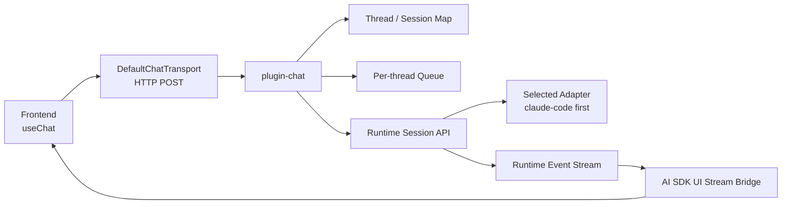

# plugin-chat 设计文档

## 1. 目的

本文档定义 AgentSuit `plugin-chat` 的第一版实现设计。

目标不是做一个完整 web 产品，而是提供一个可部署、可对接 `useChat`、可复用 runtime session 能力的 chat gateway，使当前已经打通的：

- `runtime`
- `claude-code adapter`
- Docker 单机部署

能够通过统一的 chat 协议对外暴露。

这里的“Vercel Chat SDK”在当前官方语境下，实际应理解为：

- AI SDK UI
- `useChat`
- transport system
- UIMessage data stream protocol

因此 `plugin-chat` 的目标不是绑定某个 UI 组件，而是提供一个 **兼容 `useChat` 的后端 chat bridge**。

## 2. 设计目标

### 2.1 MVP 目标

第一版必须做到：

1. 前端能用 `useChat` 发送消息到 AgentSuit。
2. `plugin-chat` 能把 chat thread 映射到 runtime session。
3. runtime 能把流式事件转成 AI SDK UI data stream。
4. 前端能收到流式 assistant 文本并正确结束一次对话。
5. 前端 `stop()` 能映射到 runtime `interrupt(sessionId)`。
6. 单机 Docker 部署下可直接暴露 chat endpoint。

### 2.2 非目标

第一版不做：

- 多平台 IM 聚合
- 完整聊天历史持久化
- resume stream
- generative UI
- 复杂 tool approval UI
- 多 tenant / 多实例编排
- WebSocket 优先协议

## 3. 当前代码库基础

当前仓库已经具备：

- `packages/runtime`
  - `startSession`
  - `sendInput`
  - `streamEvents`
  - `interrupt`
  - `closeSession`
- `packages/plugin-api`
  - exposure plugin 基础接口
- `packages/adapter-claude-code`
  - 已打通真实 Claude Agent SDK
  - 已验证本地与 Docker 容器内真实会话可用

这意味着 `plugin-chat` 不需要再碰 Claude SDK，也不应直接知道 Claude provider 细节。

它只应该依赖 runtime 的公共 session contract。

## 4. 总体架构



ASCII 视角：

```text
useChat
  -> /api/chat
    -> plugin-chat
      -> chat thread -> runtime session 映射
      -> per-thread 串行队列
      -> SessionApi.sendInput()
      -> SessionApi.streamEvents()
      -> SSE data stream protocol
      -> useChat messages
```

## 5. 核心设计原则

### 5.1 插件只依赖 runtime，不依赖 Claude

`plugin-chat` 的输入输出边界应该是：

- 输入：runtime `SessionApi`
- 输出：AI SDK UI transport / SSE protocol

不能让 `plugin-chat` 直接调用 Claude Agent SDK，否则：

- 破坏 adapter/plugin 分层
- 后面切 `codex` / `openclaw` 会返工
- chat 层会知道 provider-specific 事件

### 5.2 协议优先于前端框架

目标不是“做一个 Next.js 页面”，而是：

- 先做一个兼容 `useChat` 的协议后端
- 然后任何 React/Next.js/SSR 客户端都能接

所以应优先实现：

- HTTP endpoint
- SSE data stream protocol
- UIMessage-compatible metadata

### 5.3 先做 data stream，不做 text stream

虽然第一版只渲染文本，但协议层仍应从一开始就使用 **AI SDK UI data stream protocol**。

原因：

- 后续工具调用
- approval
- A2UI
- richer metadata

都需要 data stream，而不是纯文本流。

### 5.4 同一 thread 必须串行

同一个 chat thread 不允许多个并发输入同时写入同一个 runtime session。

否则会导致：

- Claude session 上下文错乱
- 中断语义不清
- 输出无法正确归属

因此第一版必须引入 **per-thread queue**。

## 6. 组件划分

建议新增 `packages/plugin-chat`，内部至少拆成以下模块：

```text
packages/plugin-chat/
  src/
    index.ts
    plugin.ts
    transport.ts
    stream-protocol.ts
    thread-session-store.ts
    queue.ts
    event-mapper.ts
    http-handlers.ts
    types.ts
```

### 6.1 `plugin.ts`

职责：

- 实现 `ExposurePlugin`
- 在 `setup()` 时拿到 `SessionApi`
- 在 `start()` 时启动 chat HTTP endpoint
- 在 `stop()` 时关闭 endpoint 与内部资源

### 6.2 `thread-session-store.ts`

职责：

- 维护 `chatThreadId -> runtimeSessionId`
- 支持查找、创建、删除

第一版建议内存实现：

- `Map<string, string>`

后续再替换成可持久化 store。

### 6.3 `queue.ts`

职责：

- 同一 thread 串行执行任务
- 防止多次 `sendInput` 并发打到同一 runtime session

第一版建议：

- 每个 thread 一个简单 promise chain

### 6.4 `event-mapper.ts`

职责：

- 把 runtime `AgentEvent` 映射成 AI SDK UI stream parts

这是 `plugin-chat` 的核心逻辑之一。

### 6.5 `stream-protocol.ts`

职责：

- 输出符合 AI SDK UI 的 SSE data stream
- 设置必要头：
  - `Content-Type: text/event-stream`
  - `Cache-Control: no-cache`
  - `Connection: keep-alive`
  - `x-vercel-ai-ui-message-stream: v1`

### 6.6 `http-handlers.ts`

职责：

- 暴露 chat API
- 解析请求
- 绑定 thread / session
- 调 runtime
- 回写 SSE stream

## 7. 对外接口设计

## 7.1 第一版 endpoint

建议最小只暴露两个端点：

1. `POST /api/chat`
2. `POST /api/chat/:threadId/stop`

可选：

3. `GET /healthz`

### 7.1.1 `POST /api/chat`

面向 `DefaultChatTransport`。

请求体建议兼容 `useChat` 常见字段：

```json
{
  "id": "thread_123",
  "messages": [
    {
      "id": "msg_1",
      "role": "user",
      "parts": [
        { "type": "text", "text": "帮我总结这个项目" }
      ]
    }
  ]
}
```

服务端处理规则：

1. 解析 `threadId`
2. 取最后一条 user message
3. 取 text part 拼成输入文本
4. 查找或创建 runtime session
5. 串行发送到该 thread 对应 session
6. 返回 SSE data stream

### 7.1.2 `POST /api/chat/:threadId/stop`

职责：

- 查到 `runtimeSessionId`
- 调用 `sessionApi.interrupt(sessionId)`

返回：

```json
{
  "ok": true
}
```

## 8. Chat Thread 与 Runtime Session 的映射

第一版建议一对一：

```text
chatThreadId <-> runtimeSessionId
```

规则：

- 第一次收到 thread 消息时创建 runtime session
- 后续消息复用同一个 runtime session
- `session.completed` / `session.failed` 后，允许：
  - 直接继续复用
  - 或清除映射并下次重建

第一版建议：

- `session.failed` 后清除映射
- `session.completed` 后保留映射，直到显式清理或空闲超时

原因：

- 更接近对话型 chat 预期
- 不会每轮都新建 Claude session

## 9. Runtime Event -> AI SDK UI 协议映射

这是最关键部分。

### 9.1 当前 runtime 事件

现有事件只有：

- `session.started`
- `message.delta`
- `message.completed`
- `session.failed`
- `session.completed`

### 9.2 第一版映射建议

#### `session.started`

映射为：

- `start`
- 写入 message metadata

metadata 建议包含：

- `runtimeSessionId`
- `adapterName`

#### `message.delta`

映射为：

- 首次 delta 时发 `text-start`
- 后续每次发 `text-delta`

#### `message.completed`

映射为：

- `text-end`
- `finish`

#### `session.failed`

映射为：

- `error`
- 然后关闭 stream

#### `session.completed`

如果之前已经发过 `finish`，则不重复输出。  
否则可以作为兜底 finish。

### 9.3 后续扩展位

虽然第一版不实现，但 event mapper 设计时应预留：

- tool call start
- tool input delta
- tool output available
- approval request
- reasoning
- source / citation

## 10. Message Metadata 设计

建议第一版统一在 assistant message metadata 中注入：

```json
{
  "runtimeSessionId": "runtime-uuid",
  "providerSessionId": "provider-uuid",
  "adapterName": "claude-code",
  "providerEventType": "sdk.assistant"
}
```

好处：

- 前端调试更容易
- 便于后续做 observability
- 可以保留 provider 层信息而不泄漏 adapter raw event

## 11. 中断设计

## 11.1 前端 stop

前端 `useChat().stop()` 语义应映射为：

1. 停止当前 HTTP/SSE 消费
2. 调 `POST /api/chat/:threadId/stop`
3. 服务端转 runtime `interrupt(sessionId)`

## 11.2 为什么不只停前端流

如果只在前端断流，而不真正 interrupt runtime：

- Claude 还会继续跑
- session 状态会漂移
- 后续同一 thread 再发消息时上下文不确定

所以 **真正 interrupt runtime session** 是必须的。

## 12. 状态存储

第一版建议最小内存版：

- `thread -> session` 映射：内存 Map
- `thread queue`：内存 Map

不做：

- DB
- Redis
- 持久历史

但接口要留抽象，方便后续切换。

建议定义：

- `ThreadSessionStore`
- `ThreadExecutionQueue`

这样后续可替换成：

- Redis
- SQLite
- Postgres

## 13. 与 `suit serve` 的集成

建议在后续 change 中扩展：

```bash
suit serve <path> --base-agent claude-code --expose chat --port 8080
```

第一版可约束：

- `--expose chat`
  启动 `plugin-chat`
- 没有 `--expose`
  仍只启动 runtime host

后续再扩展：

- `--expose web`
- `--expose a2a`
- `--expose a2ui`

## 14. Docker 集成

当前 Docker runtime 已可运行 Claude adapter。

`plugin-chat` 接入后，容器职责会变成：

1. 加载 Suit
2. 初始化 runtime
3. 绑定 `claude-code` adapter
4. 启动 `plugin-chat`
5. 暴露 chat HTTP/SSE endpoint

第一版建议仍保持：

- 单容器
- 单实例 runtime
- 单端口暴露

## 15. 测试设计

第一版至少应补三层测试。

### 15.1 单元测试

覆盖：

- thread/session 映射
- queue 串行语义
- runtime event -> stream part 映射
- stop -> interrupt 映射

### 15.2 集成测试

覆盖：

- `plugin-chat` 能启动 endpoint
- `POST /api/chat` 能创建 runtime session
- runtime 文本流能转成 SSE data stream
- `stop` 能中断 runtime

### 15.3 端到端 smoke

覆盖：

- Docker 启动
- `claude-code` adapter 真实对话
- `plugin-chat` SSE 输出可被客户端消费

## 16. 风险与取舍

### 16.1 当前 runtime event 太少

现在只够纯文本 MVP。  
如果要完整支持 `useChat` 的 tool / approval 体验，runtime contract 后续必须扩展。

### 16.2 Resume stream 先不做

官方文档明确 resume streams 与 abort 不兼容。  
而 AgentSuit 当前更重视 interrupt，因此 MVP 暂不支持 resume。

### 16.3 不要直接耦合 Next.js

如果第一版直接写死成 Next.js route handler，会把 `plugin-chat` 和某个 app 框架绑死。

更稳妥的是：

- `plugin-chat` 输出通用 Node/Bun HTTP handler
- 再由 demo app 或 host 框架去接

## 17. 实施建议

推荐按下面顺序推进：

1. 扩展 `plugin-api`，补 chat plugin 所需最小 contract
2. 新建 `packages/plugin-chat`
3. 先做内存版 thread/session store 和 queue
4. 实现 runtime event -> AI SDK UI data stream mapper
5. 实现 HTTP `/api/chat` 和 `/stop`
6. 扩展 `suit serve --expose chat`
7. 做一个最小 `useChat` smoke demo

## 18. 最终判断

`plugin-chat` 的本质不是“再封一层 Claude”，而是：

> 把 AgentSuit runtime session 协议桥接成 AI SDK UI / `useChat` 可消费的 chat protocol。

这条路线有三个优点：

1. 对前端生态友好
2. 对 runtime / adapter 分层友好
3. 对后续多 base agent 扩展友好

所以第一版 `plugin-chat` 的正确形态应是：

```text
runtime-first
protocol-first
HTTP/SSE-first
data-stream-first
```

而不是：

```text
provider-first
frontend-framework-first
text-only-first
```
